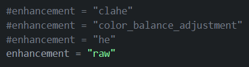

# CS-577-DeepLearning-FinalProject

## Project Description
This project aims to compare and evaluate the performance of transformer-based and traditional deep-learning object detection models on different image enhancement techniques.

The project is an extended and improved version of the final project presented for CS-577 Deep Learning course at Illinois Institute of Technology. The original project can be found [here](https://github.com/NachoGV/CS-577-DeepLearning-FinalProject). This project was developed by me, Ignacio Gomez Valverde and [Prashanth V.R.](https://github.com/Prashanth0205) who made the a first version of the YOLO preprocessing and training algorithm.

The results can be found in the project's final report, included in the [Anexes](#Anexes) section under the LinkedIn publication link.

## Dataset - Exclusively-Dark-Image-Dataset
The Exclusively Dark [(ExDark)](https://github.com/cs-chan/Exclusively-Dark-Image-Dataset) dataset was used tu develop dis project. It contains the largest collection of natural low-light images taken in visible light to date, including object level annotation. 

Preparation and preprocessing functions are provided in the `utils` folder.
### Split
* 3000 images for training - 250 per class
* 1800 images for validation - 150 per class
* 2563 images for testing - rest of the images per class

## Model Information
### Utils Folder
Some usefull custom made functions for the project that can be executed from the terminal (locating the user in this folder using the `cd` command) or from the data-preparation notebook.
### Enhancement Configurations
For the transformer model, a cell is provided with the different enhancement options or "raw" if user just wants to train using default data. 

**Disclaimer**: A resize and some othe preprocessing adjustments are made either if the user selects an option or leaves the "raw" version of the images. 

## Authors
* Ignacio Gomez Valverde - [LinkedIn Profile](https://www.linkedin.com/in/ignacio-gomez-valverde/)

## References 
### YOLO
* [Ultralytics Documentation](https://docs.ultralytics.com/)
### Transformer
* [End-to-End Detection with Transformers](https://arxiv.org/abs/2005.12872)
* [Detection-Transformer](https://github.com/AarohiSingla/Detection-Transformer/tree/main)
* [Using Custom Datasets to train DETR for object detection](https://medium.com/@soumyajitdatta123/using-custom-datasets-to-train-detr-for-object-detection-75a6426b3f4e)

More references can be found in the project's final report

## Anexes
* Final Report Parper - [PDF]()(TODO) or [LinkedIn Post]()(TODO)